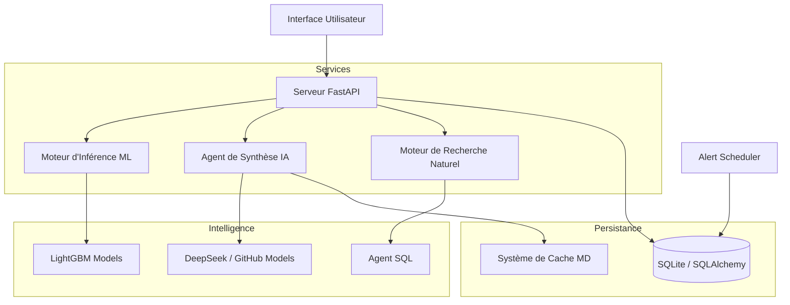

# AnalytixCare - Plateforme de Maintenance Industrielle Prédictive

## Présentation Générale

AnalytixCare est une plateforme de maintenance industrielle 4.0 opérationnelle, conçue pour transformer les données machine en décisions stratégiques. Ce projet concrétise l'implémentation d'une architecture robuste structurée en moteurs spécialisés, garantissant une boucle complète allant de la donnée brute à l'intelligence décisionnelle.

## Réalisation de l'Architecture Système

L'ensemble de l'architecture a été déployé de manière modulaire, assurant une séparation claire des responsabilités techniques et une interopérabilité fluide.

## Fonctionnalités Implémentées par Module

### 1. User Interface (Interface de Supervision)

Développement d'un centre de contrôle dynamique pour la surveillance des actifs.

* **Dashboard Industriel** : Visualisation en temps réel des KPIs financiers, de fiabilité et des prédictions de pannes.
* **Espace Conducteur** : Terminal mobile sécurisé permettant aux opérateurs de vérifier l'état de santé de leur véhicule via un ID unique.
* **Système de Notifications** : Implémentation de toasts et d'un centre d'alertes pour signaler les risques critiques instantanément.

### 2. NLQ Engine (Interrogation Naturelle)

Mise en place d'une interface conversationnelle pour l'exploration de données.

* **Agent SQL Intelligent** : Traduction automatique du langage naturel en requêtes complexes pour extraire des rapports de performance sans connaissances techniques en base de données.

### 3. Data Prep Engine (Préparation & Qualité)

Industrialisation de la chaîne de traitement des données.

* **Pipeline de Nettoyage** : Normalisation automatique des formats de données (accents, types, unités).
* **Garantie de Qualité** : Validation et enrichissement des données importées pour assurer la cohérence des prédictions.
* **Traçabilité (Logs)** : Suivi rigoureux de toutes les opérations système pour le diagnostic et l'audit.

### 4. Predictive Engine (Moteur de Prédiction)

Déploiement de l'intelligence artificielle d'anticipation.

* **Inférence ML** : Utilisation de modèles de pointe (LightGBM) pour classifier les types de pannes et régresser vers le délai de défaillance.
* **Validation & Test** : Processus d'évaluation garantissant la précision des probabilités de pannes générées.

### 5. Insight Engine (Briefing Stratégique)

Conversion des données techniques en valeur métier.

* **Briefing IA Quotidien** : Génération autonome de rapports de synthèse identifiant les priorités opérationnelles et les opportunités d'économie.
* **Analyse Sémantique** : Utilisation des LLM pour interpréter les tendances et conseiller la direction.

### 6. Explain Insight (Alerte & Explications)

Rendre l'IA transparente et actionnable.

* **Gestionnaire d'Alertes IA** : Algorithme de détection des situations critiques basé sur des seuils de probabilité personnalisés.
* **Feuille de Route Maintenance** : Identification des pièces défectueuses et des composants impactés pour faciliter l'intervention humaine.

## Lancement de la Plateforme

1. **Environnement** : `pip install -r requirements.txt`
2. **Configuration** : Renseigner les clés de service dans le fichier `.env`.
3. **Démarrage** : Exécuter `uvicorn api.main:app --reload` pour ouvrir l'interface.

---

AnalytixCare - L'implémentation de l'intelligence industrielle au service de votre excellence.
