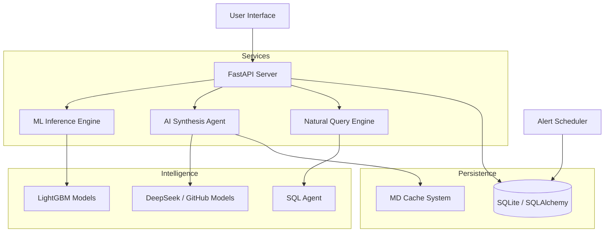

# AnalytixCare - Predictive Industrial Maintenance Platform

## Overview

AnalytixCare is an operational Industry 4.0 maintenance platform designed to transform machine data into strategic decisions. This project implements a robust architecture structured into specialized engines, ensuring a complete loop from raw data to decision intelligence.

## System Architecture

The entire architecture has been deployed in a modular fashion, ensuring clear separation of technical responsibilities and fluid interoperability.



---

## Technical Project Structure

### **`api/`** - FastAPI Backend Server

#### `main.py` (967 lines)
**Role**: Main application entry point. FastAPI server orchestrating all services.

**Responsibilities**:
- Application lifecycle configuration (lifespan)
- ML models and database initialization at startup
- JWT authentication management (login, tokens, user profiles)
- REST endpoint exposure for:
  - Financial KPIs (`/api/kpi/financial`)
  - Human resources KPIs (`/api/kpi/resources`, `/api/kpi/hr/regional_stats`)
  - Inventory KPIs (`/api/kpi/inventory`, `/api/inventory/forecast`)
  - Failure distribution (`/api/kpi/failures`)
  - Global statistics (`/api/kpi/stats`)
  - ML predictions (`/predict/csv`, `/predictions`)
  - Notifications (`/api/notifications`)
  - NLQ queries (`/ask`)
  - Excel report export (`/api/export/audit`)
- Static files mounting (HTML, CSS, JS)
- Automatic alert scheduler startup

**Technologies**: FastAPI, SQLAlchemy, Jose (JWT), Passlib (hashing), Pandas, Uvicorn

---

#### `structure_db.py` (266 lines)
**Role**: Complete relational database schema (Data Warehouse).

**Defined Models**:

**Dimensions**:
- `DimRegion`: Geographic regions and climate
- `DimFailureType`: Engine failure types
- `DimPart`: Spare parts catalog (unit cost, criticality)
- `DimCustomer`: Customers and fleets
- `DimDealer`: Dealers and technical capacity
- `DimVehicle`: Vehicles (engine model, age, warranty)
- `DimDate`: Time dimension (year, month, day)
- `User`: Platform users (authentication)

**Facts**:
- `FactVehicleFailure`: Actual failure history
- `FactPrediction`: AI prediction logs (inputs + outputs)
- `FactTrainingData`: ML training dataset
- `FactMaintenanceLog`: Maintenance history and costs
- `FactInventory`: Stock status by dealer
- `FactHRForecast`: Technician needs forecasts
- `FactInventoryForecast`: Stock shortage forecasts
- `FactInvestmentForecast`: ROI and cost forecasts
- `FactWarrantyImpact`: Warranty financial impact
- `FactNotification`: AI agent-generated alerts

**Database**: `Companyx_database.db` (SQLite)

---

### **`inference/`** - ML Prediction Engine

#### `prediction_service.py`
**Role**: Inference pipeline for engine failure predictions.

**Features**:
- Loading pre-trained LightGBM models from `models/`
- Input data preprocessing (normalization, encoding)
- Simultaneous prediction:
  - **Classification**: Failure type (Overheating, Lubrication failure, etc.)
  - **Regression**: Days before failure
  - **Probability**: Prediction confidence level
- Strict feature validation (order and presence)
- Column misalignment error handling

**Models used**:
- `failure_type_model.joblib`: Failure type classifier
- `days_before_failure_model.joblib`: Delay regressor
- `scaler.pkl`: StandardScaler normalizer
- `label_encoders.pkl`: Categorical variable encoders
- `feature_names.pkl`: Ordered list of expected features

---

### **`preprocessing/`** - Data Preparation

#### `preprocess.py`
**Role**: Raw data cleaning and normalization before training or inference.

**Transformations**:
- Accent removal and Unicode normalization
- Data type conversion (dates, numerics)
- Missing value handling
- Column consistency validation
- Column name mapping (FR → EN)

---

### **`query_engine/`** - NLQ Engine (Natural Language Query)

#### `sql_agent.py`
**Role**: Conversational agent to query the database in natural language.

**Features**:
- Automatic translation of French questions to SQL
- LLM usage (Google Gemini or DeepSeek) to generate queries
- Secure query execution on `Companyx_database.db`
- Natural language result formatting
- SQL error handling and automatic reformulation

**Example**: "How many vehicles are under warranty?" → `SELECT COUNT(*) FROM DIM_VEHICLE WHERE under_warranty = 'Oui'`

---

### **`agents/`** - Autonomous Agents

#### `alert_scheduler.py`
**Role**: Background scheduler for continuous risk monitoring.

**Features**:
- Periodic execution (every 60 seconds)
- Critical prediction detection (probability > 80%)
- Automatic notification generation in `FactNotification`
- Alert deduplication (avoids duplicates)
- Daemon thread for clean shutdown with API

---

#### `driver_notification.py`
**Role**: Dedicated agent for drivers to check their vehicle status.

**Features**:
- Endpoint `/api/driver/alerts/{vehicle_id}`
- Failure prediction search for a specific vehicle
- Status return: `OK`, `WARNING`, or `CRITICAL`
- Action recommendations (inspection, urgent maintenance)

---

### **`agent_ai/`** - Generative Artificial Intelligence

#### `ai_agent.py`
**Role**: Strategic synthesis agent using LLMs to generate briefings.

**Features**:
- KPI and database trend analysis
- Executive report generation in natural language
- Cost-saving opportunity and risk identification
- Strategic recommendations for management

---

#### `llm_client.py`
**Role**: Unified client for LLM calls (multi-provider abstraction).

**Supported providers**:
- Google Gemini (via API)
- DeepSeek (via API)
- GitHub Models (fallback)

**Features**:
- API key management from `.env`
- Automatic retry on failure
- Provider fallback

---

### **`core/`** - Configuration and Utilities

#### `config.py`
**Role**: Application configuration centralization.

**Content**:
- Database paths
- ML model parameters
- LLM configuration
- Environment variables

---

#### `logging.py`
**Role**: Centralized logging system for debugging and auditing.

**Features**:
- Structured logs (timestamp, level, module)
- Log file rotation
- Levels: DEBUG, INFO, WARNING, ERROR, CRITICAL

---

### **`discovery_engine/`** - Exploration and Traceability

#### `tracking.py`
**Role**: Operations tracking and performance metrics system.

**Features**:
- Prediction traceability
- Model performance metrics
- Compliance audit logs

---

### **`models/`** - Pre-trained ML Models

| File | Description |
|------|-------------|
| `failure_type_model.joblib` | LightGBM classifier for failure type (6 classes) |
| `days_before_failure_model.joblib` | LightGBM regressor for delay before failure |
| `scaler.pkl` | StandardScaler for numeric feature normalization |
| `label_encoders.pkl` | LabelEncoders for categorical variables (region, engine model) |
| `feature_names.pkl` | Ordered list of 19 expected features |
| `features.joblib` | Feature metadata (types, ranges) |

**Training**: Models trained on `FACT_TRAINING_DATA` with cross-validation.

---

### **`api/static/`** - User Interface

#### **HTML**

##### `login.html`
**Role**: Authentication page.

**Features**:
- Email/password form
- Call to `/api/auth/token` to obtain JWT
- Token storage in `localStorage`
- Redirect to `/dashboard` after login

---

##### `dashboard.html`
**Role**: Main supervision interface (control center).

**Sections**:
- **Real-time KPIs**: Critical fleet, costs, reliability, parts availability
- **Charts**: Failure distribution, costs by region, warranty, ROI
- **Prediction table**: Latest AI predictions with filters
- **Simulators**: HR, inventory, investment forecasts
- **User profile**: Information and password modification
- **Notification center**: Real-time critical alerts

**Technologies**: Chart.js, Fetch API, DOM manipulation

---

##### `driver.html`
**Role**: Mobile portal for drivers.

**Features**:
- Vehicle ID input
- Health status display (OK, WARNING, CRITICAL)
- Action recommendations
- Responsive interface (mobile-first)

---

#### **JavaScript**

##### `js/dashboard.js`
**Role**: Dashboard business logic.

**Features**:
- Chart.js chart initialization
- KPI polling every 30 seconds
- Filter management (region, engine model, vehicle)
- CSV file upload for predictions
- Excel report export
- User profile management (JWT)
- Notification system with toasts
- Section navigation (SPA)

---

#### **CSS**

##### `css/analytixcare.css`
**Role**: Main application styles.

**Content**:
- Design system (colors, typography, spacing)
- Reusable components (cards, buttons, inputs)
- Responsive layout (grid, flexbox)
- Animations and transitions

---

##### `css/premium.css`
**Role**: Premium styles for advanced elements.

**Content**:
- Glassmorphism for modals
- Advanced gradients and shadows
- Loading animations
- Sophisticated hover effects

---

### **`scripts/`** - Maintenance Utilities

#### `clear_fact_prediction.py`
**Role**: `FACT_PREDICTION` table cleanup script.

**Usage**:
```bash
python scripts/clear_fact_prediction.py
```

**Features**:
- Deletion of all prediction records
- Display of deleted record count
- Error handling with rollback

---

### **`data/`** - Training and Test Data

**Structure**:
- `raw/`: Raw data (original CSV)
- `processed/`: Cleaned and normalized data

**Typical files**:
- `Pannes_moteurs_equilibre_Maroc.csv`: Training dataset
- `test_pree.csv`: Test data for validation

---

## Configuration Files

### `.env`
**Role**: Sensitive environment variables (not versioned).

**Content**:
```env
GOOGLE_API_KEY=your_key_here
DEEPSEEK_API_KEY=your_key_here
DATABASE_URL=sqlite:///./Companyx_database.db
SECRET_KEY=analytix_care_secret_2026
```

---

### `requirements.txt`
**Role**: Project Python dependencies.

**Main libraries**:
- `fastapi`: Web framework
- `uvicorn`: ASGI server
- `sqlalchemy`: ORM
- `lightgbm`: ML models
- `pandas`: Data manipulation
- `scikit-learn`: ML preprocessing
- `python-jose`: JWT
- `passlib`: Password hashing
- `langchain`: LLM framework

---

### `correspondances.xlsx`
**Role**: Reference mapping between failure types and affected parts.

**Content**:
- Column A: Failure type
- Column B: Defective parts
- Column C: Impacted parts

**Usage**: Reference to enrich predictions with concerned parts.

---

## Platform Launch

### 1. Installation
```bash
pip install -r requirements.txt
```

### 2. Configuration
Create a `.env` file with your API keys:
```env
GOOGLE_API_KEY=your_google_api_key
DEEPSEEK_API_KEY=your_deepseek_api_key
```

### 3. Startup
```bash
# From App_AnalytixCare/ folder
python api/main.py
```

Or use the batch script (Windows):
```bash
# From root folder
.\lancer_api.bat
```

### 4. Access
- **Dashboard**: http://127.0.0.1:8000/dashboard
- **Login**: http://127.0.0.1:8000/login
- **Driver Portal**: http://127.0.0.1:8000/driver
- **API Docs**: http://127.0.0.1:8000/docs

### 5. Default credentials
- **Email**: `admin@analytixcare.com`
- **Password**: `admin123`

---

## Data Flows

### 1. ML Prediction
```
CSV Upload → preprocessing.py → prediction_service.py → FactPrediction (DB) → Dashboard
```

### 2. Automatic Alerts
```
alert_scheduler.py (polling) → FactPrediction (DB) → FactNotification (DB) → Dashboard (toasts)
```

### 3. NLQ Query
```
User Question → sql_agent.py → LLM (SQL generation) → DB Query → Natural Language Response
```

### 4. AI Briefing
```
ai_agent.py → DB Analysis → LLM (synthesis) → Executive Report (Markdown)
```

---

## Database

### Main Schema: `Companyx_database.db`

**Dimensions**: 7 tables (Region, FailureType, Part, Customer, Dealer, Vehicle, Date)  
**Facts**: 10 tables (VehicleFailure, Prediction, TrainingData, MaintenanceLog, Inventory, HRForecast, InventoryForecast, InvestmentForecast, WarrantyImpact, Notification)  
**Users**: 1 table (User)

**Typical size**: ~15 MB (with production data)

---

## Key Technologies

| Category | Technologies |
|----------|-------------|
| **Backend** | FastAPI, SQLAlchemy, Uvicorn |
| **ML** | LightGBM, Scikit-learn, Pandas |
| **Generative AI** | Google Gemini, DeepSeek, LangChain |
| **Frontend** | Vanilla JS, Chart.js, HTML5/CSS3 |
| **Database** | SQLite |
| **Security** | JWT (Jose), Bcrypt (Passlib) |
| **Deployment** | Python 3.9+, Windows/Linux |

---

AnalytixCare - Industrial intelligence implementation at the service of your excellence.
