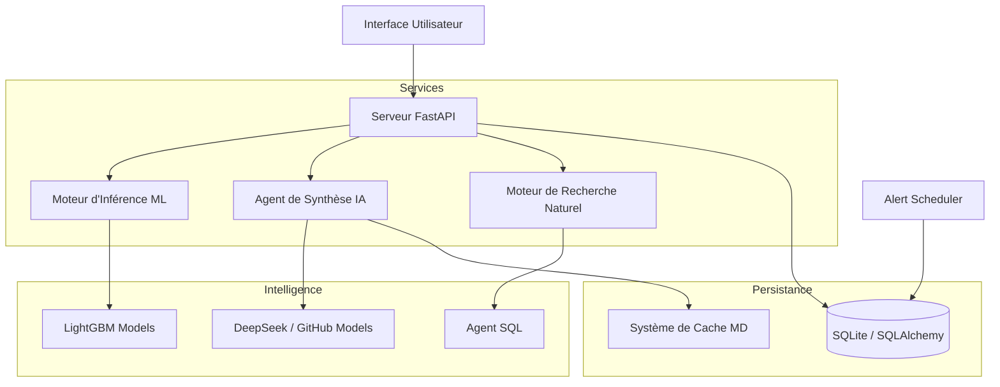

# Rapport Technique : AnalytixCare Industrial Intelligence

## Introduction
AnalytixCare est une solution de maintenance prédictive de grade industriel conçue pour maximiser le taux de disponibilité (OEE) des équipements critiques. Ce document détaille l'architecture logicielle, les moteurs d'intelligence artificielle et les protocoles de sécurité mis en œuvre dans la version finale du projet.

---

## Architecture Système

Le système repose sur une architecture modulaire découplée, permettant une scalabilité horizontale des services d'analyse.

---

## Composants de l'Intelligence Artificielle

### 1. Moteur de Prédiction (Inference Engine)
Le moteur utilise deux modèles LightGBM (Gradient Boosting Machine) entraînés sur des données de télémétrie industrielle (Vibrations, Température, Pression, Charge).
- **Classification Multiclasse** : Identification du vecteur de défaillance parmi 6 catégories prioritaires.
- **Régression Linéaire Optimisée** : Calcul du délai avant défaillance exprimé en jours.
- **Traitement de Données** : Pipeline de normalisation MinMaxScaler et encodage catégoriel robuste.

### 2. Agent de Briefing Stratégique (agent_ai)
Cet agent transforme les probabilités brutes en résumés décisionnels pour la direction.
- **Optimisation de Latence** : Implémentation d'un cache local horodaté pour garantir une disponibilité instantanée des rapports et réduire la consommation de tokens.
- **Fallback Logic** : En cas d'indisponibilité du service LLM, l'agent bascule sur un moteur de synthèse statistique interne.

### 3. Moteur de Requêtes Naturelles (query_engine)
Interface permettant aux opérateurs non-techniques d'interroger la base de données via le langage naturel.
- **Contextualisation SQL** : L'agent dispose du schéma relationnel complet pour générer des requêtes SQL précises et sécurisées (ReadOnly).

---

## Gestion des Données et Sécurité

### Architecture de Données
Le projet utilise un modèle de données en étoile (Star Schema) simplifié pour optimiser les performances de lecture :
- **FACT_PREDICTION** : Table centrale regroupant les entrées capteurs et les sorties modèles.
- **FACT_NOTIFICATION** : Journal des alertes critiques générées par le planificateur de surveillance.
- **DIM_VEHICLE / DIM_PART** : Dimensions référentielles pour l'identification des actifs.

### Sécurité et Robustesse
- **Gestion des Secrets** : Séparation stricte des configurations via des fichiers d'environnement (`.env`) exclus du versionnage Git.
- **Normalisation des Entrées** : Le système de mapping des pannes est insensible à la casse et aux accents, garantissant la fiabilité des rapports quel que soit le format du fichier CSV source.
- **Contrôle d'Accès** : Authentification via tokens JWT pour sécuriser les endpoints sensibles.

---

## Protocoles de Maintenance Technique

### Réinitialisation du Système
Pour les phases de démonstration, deux utilitaires critiques sont fournis :
1. `drop_fact_prediction.py` : Purge sécurisée de l'historique des prédictions.
2. `etl_full_enterprise.py` : Initialisation de la structure et chargement des données de référence.

### Déploiement
Le serveur API est lancé via `uvicorn` sur l'interface locale `127.0.0.1:8000`. Le centre de notifications s'active automatiquement dès le démarrage du serveur pour assurer une surveillance en temps réel sans intervention manuelle.

---
*Fin du document technique.*
