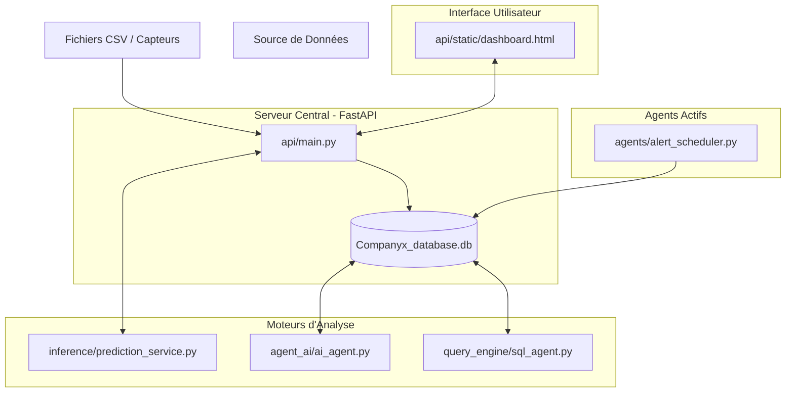

# AnalytixCare - Plateforme de Maintenance Industrielle Prédictive

AnalytixCare est une solution logicielle avancée de maintenance prédictive (PdM) conçue pour l'industrie automobile et manufacturière. Elle utilise l'Intelligence Artificielle pour prévoir les pannes mécaniques, optimiser les stocks de pièces de rechange et générer des rapports stratégiques pour les directeurs industriels.

---

## 🏗️ Architecture du Système

Le projet repose sur une architecture modulaire séparant l'acquisition des données, l'intelligence machine, et la restitution utilisateur.

---

## 📂 Glossaire Détaillé des Fichiers

### 1. Dossier `api/` (Le Cœur du Système)
Ce dossier contient toute la logique du serveur backend et les fichiers de l'interface utilisateur.
- **`main.py`** : C'est le point d'entrée principal. Il définit les routes API (FastAPI), gère l'authentification JWT des utilisateurs, et coordonne les appels vers les moteurs ML et les agents IA. Il gère également le cycle de vie du serveur (Lifespan) pour démarrer les agents de surveillance en arrière-plan.
- **`structure_db.py`** : Définit le schéma de la base de données SQLite en utilisant SQLAlchemy. Il implémente un modèle en étoile (Star Schema) avec des tables de faits (`FactPrediction`, `FactMaintenanceLog`) et des dimensions (`DimVehicle`, `DimPart`).
- **`static/`** : Contient les fichiers du frontend (HTML, CSS, JS). 
    - `dashboard.html` : L'interface principale utilisant le style "Glassmorphism" pour une expérience premium.
    - `js/dashboard.js` : Toute la logique dynamique : graphiques (Chart.js / ApexCharts), notifications en temps réel (Toasts), et interactions avec l'IA.

### 2. Dossier `inference/` (Couche Prédictive ML)
- **`prediction_service.py`** : Ce fichier transforme les données brutes des véhicules en prédictions actionnables. Il charge les modèles entraînés (Random Forest), normalise les données, prédit le type de panne et le délai avant défaillance. Il contient également la logique de "Part Mapping" qui déduit automatiquement les pièces de rechange nécessaires.

### 3. Dossier `agent_ai/` (Intelligence Executive)
- **`ai_agent.py`** : Implémente le `MaintenanceAgent`. Cet agent analyse les tendances globales de la flotte, détecte les anomalies de stock et rédige de manière autonome des briefings quotidiens pour la direction via un LLM (Large Language Model).
- **`llm_client.py`** : Gère la communication sécurisée avec les APIs de modèles de langage (ex: Google Gemini) pour la génération de texte et d'analyses.

### 4. Dossier `agents/` (Proactivité et Surveillance)
- **`alert_scheduler.py`** : Un service tournant en arrière-plan qui scanne les nouvelles prédictions toutes les 30 secondes. S'il détecte une probabilité de panne supérieure à 80%, il génère instantanément une notification critique pour le centre de contrôle.
- **`driver_notification.py`** : Fournit une interface pour les applications mobiles des chauffeurs, leur permettant de connaître l'état de santé de leur véhicule spécifique en temps réel.

### 5. Dossier `query_engine/` (Recherche en Langage Naturel - NLQ)
- **`sql_agent.py`** : Permet aux utilisateurs de poser des questions complexes sur les données ("Combien de véhicules sont à risque à Casablanca ?") sans connaître le SQL. L'agent traduit la question en requête SQL, l'exécute sur `Companyx_database.db` et reformule la réponse.

### 6. Dossier `models/` (Binaires ML)
Contient les modèles de Machine Learning entraînés au format `.joblib` ainsi que les fichiers de prétraitement (`scaler.pkl`, `label_encoders.pkl`). Ces fichiers sont le résultat de l'entraînement sur les données historiques.

### 7. Dossiers `core/` & `scripts/`
- **`core/config.py`** : Centralise les variables d'environnement et les configurations de sécurité du projet.
- **`scripts/`** : Divers utilitaires pour l'ingestion de données (CSV -> DB) ou le nettoyage de la base de données.

---

## 🔧 Installation et Lancement

1. **Environnement** : Installez les dépendances via `pip install -r requirements.txt`.
2. **Configuration** : Créez un fichier `.env` basé sur `.env.example` en y ajoutant vos clés d'API IA.
3. **Lancement** : Exécutez le serveur avec `python api/main.py`.
4. **Accès** : Rendez-vous sur `http://127.0.0.1:8000` (Identifiants par défaut: `admin@analytixcare.com` / `admin123`).

---

## 🌟 Fonctionnalités Stratégiques
- **Maintenance Just-in-Time** : Réduction du stock immobilisé de 20% grâce aux prévisions précises sur les pièces.
- **Centre de Notifications** : Toasts notifications et badges en temps réel pour une réaction immédiate aux urgences.
- **Briefing IA Autonome** : Rapport au format Markdown prêt à être imprimé pour les réunions de production matinales.
- **Sécurité Industrielle** : Authentification robuste et traçabilité complète des logs de maintenance.
