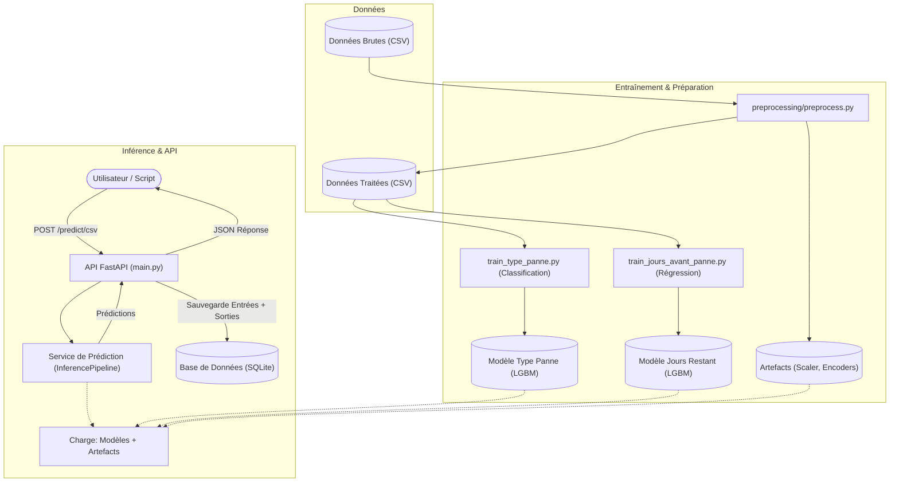

# Schéma de Fonctionnement du Système de Maintenance Prédictive

Ce document décrit l'architecture et le flux de données de votre système de maintenance prédictive. Le système est conçu pour prédire le type de panne à venir et le nombre de jours restants avant cette panne pour des véhicules.

## Architecture Globale

Le système est composé de trois blocs principaux :
1.  **Pipeline d'Entraînement** : Prépare les données et entraîne les modèles IA.
2.  **API & Inférence** : Sert les prédictions en temps réel via une API REST.
3.  **Stockage** : Archive les prédictions et les données véhicules pour consultation (NLQ, Dashboard).

---

## Flux de Fonctionnement Détaillé

### 1. Phase de Préparation et Entraînement

Cette phase est exécutée périodiquement (ou au besoin) pour mettre à jour l'intelligence du système.

1.  **Chargement & Nettoyage (`preprocess.py`)** :
    *   Lit les données brutes (ex: `data_test_real.csv`).
    *   Nettoie les données (suppression colonnes inutiles, gestion NaN).
    *   Encode les variables catégorielles (ex: Ville, Modèle).
    *   Normalise les variables numériques (ex: Température, RPM).
    *   **Sortie** : `dataset_pretraite.csv`, `scaler.pkl`, `label_encoders.pkl`.

2.  **Entraînement des Modèles** :
    *   **Classification (`train_type_panne.py`)** : Entraîne un modèle LightGBM pour prédire `type_panne_moteur`. Génère `type_panne_model.joblib`.
    *   **Régression (`train_jours_avant_panne.py`)** : Entraîne un modèle LightGBM pour prédire `jours_avant_panne`. Génère `jours_avant_panne_model.joblib`.

### 2. Phase d'Inférence (Temps Réel)

C'est le mode "production" où l'API répond aux demandes.

1.  **Réception** : L'API reçoit un fichier CSV contenant les données actuelles de véhicules.
2.  **Prétraitement à la volée** : Le `PredictionService` applique exactement les mêmes transformations (scaling, encoding) que lors de l'entraînement, en utilisant les artefacts sauvegardés (`scaler.pkl`, etc.).
3.  **Prédiction** :
    *   Le modèle de **Classification** prédit le type de panne probable.
    *   Le modèle de **Régression** estime le nombre de jours restants.
    *   Les résultats sont combinés.
4.  **Stockage** : L'API enregistre dans la base de données `predictions.db` une ligne complète pour chaque véhicule contenant :
    *   L'identifiant véhicule.
    *   Les conditions au moment de la prédiction (RPM, Température, etc.).
    *   Les prédictions de l'IA.
5.  **Réponse** : L'API renvoie les prédictions au format JSON à l'utilisateur.

## Structure des Dossiers Clés

*   `api/` : Code du serveur web et gestion de la base de données.
*   `inference/` : Logique métier pour charger les modèles et faire des prédictions.
*   `models/` : Stockage des fichiers binaires des modèles entraînés et scalers.
*   `scripts/` : Scripts utilitaires pour tester ou réentraîner automatiquement.
*   `training/` : Scripts de création des modèles ML.
